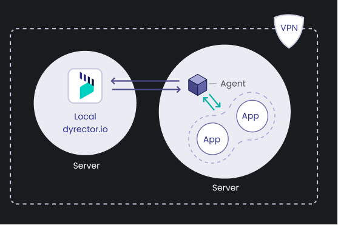

# How it works

dyrector.io consists of an agent – crane for Kubernetes API and dagent for Docker API, both written in Go – and a platform (UI developed in React.js, Next.js. Backend developed in Node.js, Nest.js). Communication between the agents and the platform takes place in gRPC with TLS encryption. The data is managed in a PostgreSQL database which we use with Prisma ORM.

### Architecture

You can use dyrector.io in a cloud-hosted or a self-hosted way.

#### Cloud-hosted – Coming soon&#x20;

By using cloud-hosted dyrector.io, you’re able to setup dyrector.io’s agent to your Nodes. Nodes are your already existing environments in Docker or Kubernetes. When you register your Node, you need to select the corresponding API to your technology, Docker or Kubernetes.&#x20;

To add a Node, you need to run the one-liner script generated by us in your Node’s terminal. The one-liner script will run a script that'll install dyrector.io's agent to your Node. The agent will then run on your infrastructure to set up instances.


As of now, you can only use dyrector.io in a self-hosted manner. Cloud-hosted access is in the works.


This is how dyrector.io will operate if you decide to use our free or paid packages. Learn more about our packages [**here**](../learn-more/pricing.md).

#### Self-hosted

Similar to the cloud-hosted way, you can use self-hosted dyrector.io with Docker or Kubernetes. The only difference is it’s up to you where dyrector.io will run.

If you don’t want to configure your own dyrector.io, check our packages to see one that’ll fit your needs.


One of the most important benefits of self-hosted dyrector.io is that you can use the environment where you run dyrector.io as an instant test environment by deploying the application to it.


