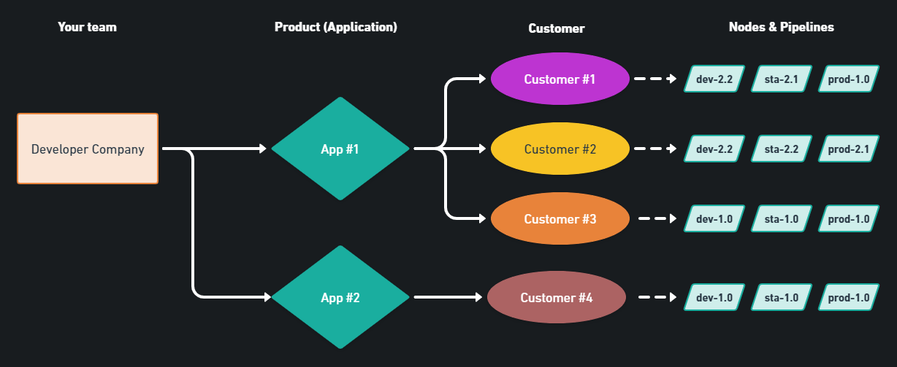

# Use cases

### Multi-Instance Deployments

The key purpose of multi-instance deployments is to avoid repetitive tasks when the same stack needs to be deployed to dozens or hundreds of deployment targets. After configuring the stack once, you're able to select all the nodes where you'd like to set it up.

Below you can see a flowchart that illustrates how you can deploy the same stack to multiple businesses at the same time.

Another scenario is when a 3rd-party redistributes the application your organization develops. In the flowchart below you can see how this process differs from direct distribution as described above.

.png>)

> **In progress:** Bundled configurations enable your team to assign templatized configurations through the whole process. This significantly reduces the risk of specifying incorrect configurations.

### Docker & Kubernetes utilization without specialists

dyrector.io accelerates Docker and Kubernetes adoption by providing abstractions to these technologies. The platform covers container management capabilities in both container orchestrators, including starting, restarting and stopping containers, as well as configuring images into deployable versions.

It allows engineering teams and organizations to only involve DevOps engineers and other specialists when their presence is really needed.

### Instant test environments

QA, PMs and salespeople can spark up your stack instantly on their own by deploying the stack to their local machine or a demo environment as a project on dyrector.io.

### **And more, including**

* Installing Next.js apps with NGINX to a VPS or a Kubernetes cluster
* Installing single images (like RabbitMQ or a database)
* Checking server/cluster status
