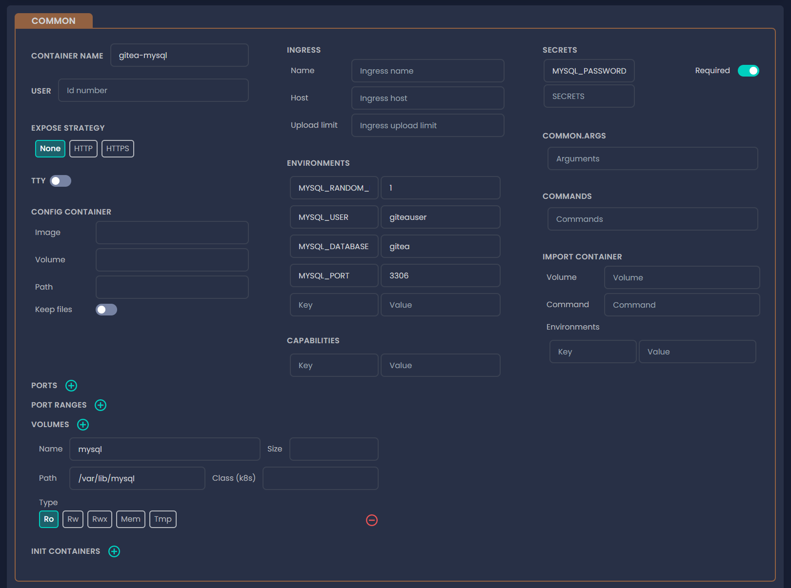

# Configuration management

Configurations can be all over the place without a single source of truth when left unmanaged for long periods of time. The more configurations you need to deal with, the more likely you’ll lose track of them. The platform can be used as single source of truth for all of your configurations, while being able to add, remove or modify configurations directly or via the JSON editor.

Every configuration you specify will remain stored after any modification or deletion to ensure you won’t have to spend time again defining already specified configurations.

### How is it better than using a Git repository?

Git repositories containing the configurations of your microservice architecture can be all over the place because one repo won’t cover all the configurations for all the images & components in your architecture. The platform substitutes Git repos by bringing every variable that belong to a specific Product in one place.

#### Best practices

* **Think ahead:** designing is the first step towards efficient and secure configuration management. Go through your organization’s structure, consider privileges and access points. This step is crucial for more efficient configuration management.
* **Configuration roll back:** if it turns out the new configuration is faulty, you can roll back the last functioning ones.
* **In progress – Bundled configurations:** instead of specifying the same configurations one by one to each component, you can apply variables to multiple components with one click by bundling them up.

### Configuration customization

You're able to define configurations for both images of a [**Project**](../tutorials/create-your-product/) and [**Deployments**](../tutorials/deploy-your-product.md). Variables that belong to images can be overwritten by deployment variables. Below you can see how you're able to filter variables in the configuration management screen.


You can also use sub filters to hide irrelevant variables to your configs. Below you can see all the variables for each filter – common, Kubernetes and Docker.

* **Common**

<figure><figcaption></figcaption></figure>

* **Kubernetes**

<figure><figcaption></figcaption></figure>

* **Docker**

<figure><figcaption></figcaption></figure>

#### JSON

You're also able to customize your configuration in a JSON format, for easier copying.

The result should look like this:

```json5
{
  // Container runtime user.
  "user": null,
  // Pseudo terminal allocation.
  "tty": false,
  // Maps an internal 80 to external 8080, external refers to the host's port.
  "ports": [    
    {
      "internal": 80,
      "external": 8080
    }
  ],
  "portRanges": [],
  "volumes": [],
  // In Docker terminology, this is the equivalent of entrypoint.
  //
  // commands and args following one another will be the entrypoint, the actual
  // starting parameter of the container.
  "commands": [],
  // Equals to CMD in Docker terminology.
  "args": [],
  // Possible variables can be none, expose, exposeWithTls.
  "expose": null,
  // When left undefined, the container's name by default. Domain suffix comes
  // after. The two together makes up a rootable domain for the host.
  "ingress": {
    "name": "traefik",
    "host": ""
  },
  // An OCI image containing assets or other artifacts, copied over pre-start.
  "configContainer": null,
  // Pull assets and artifacts from remote sources, such as object stores, remote
  // services, and so on.
  "importContainer": null,
  // standard initContainers
  "InitContainers": []InitContainer
  // Docker only, see Docker documentation
  // https://docs.docker.com/config/containers/logging/configure/
  "logConfig": null,
  // Standard variable. Can be always, none, unless_stopped, and so on.
  "restartPolicy": "unless_stopped",
  // Docker specific networkMode configuration.
  "networkMode": "none",
  // Existing networks to attach the container with.
  "networks": [],
  // Kubernetes only. See Kubernetes documentation.
  "deploymentStrategy": "unknown",
  // HTTP reverse proxy custom headers.
  "customHeaders": [],
  // Widely used headers in case of RESTful APIs.
  "proxyHeaders": false,
  // Kubernetes only. See Kubernetes documentation. Changes service
  // type to loadbalancer.
  "useLoadBalancer": false,
  // Kubernetes only. See Kubernetes documentation. Custom
  // loadbalancer annotations, eg. to define internal loadbalancer.
  "extraLBAnnotations": null,
  // Kubernetes only. See Kubernetes documentation.
  "healthCheckConfig": null,
  // Kubernetes only. See Kubernetes documentation.
  "resourceConfig": null,
  // Running application container name.
  "name": "mysql",
  // Environment variables used to configure application behavior.
  // Tribute to https://12factor.net
  "environment": {},
  // WIP (not available yet) configure container behavior based on annotations.
  "capabilities": {},
  // Standard Docker labels. See Docker documentation.
  "dockerLabels": {},
  // Custom labels for each basic k8s component.
  "labels": {
    // Key value pairs for k8s deployments.
    "deployment": null,
    // Key value pairs for k8s service.
    "service": null,
    // Key value pairs for k8s ingress.
    "ingress": null
  },
  // Custom annotations for each basic k8s component. See labels above,
  // or k8s documentation.
  "annotations": null
}
```
