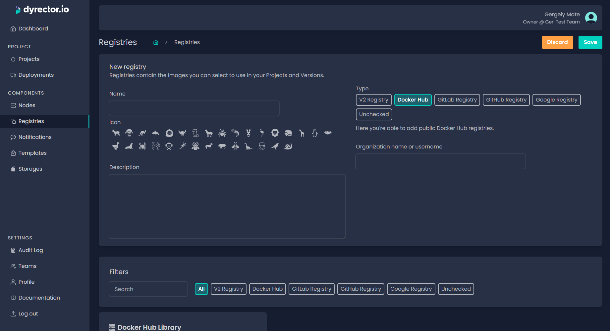

# Add Docker Hub Registry

Docker Hub is a public image library. You can add registries from Docker Hub in dyrector.io with the following steps.

**Step 1:** Open Registries on the left and click ‘Add’ on the top right.

**Step 2:** Enter your registry’s name and select an icon.


**Tip:** You can write a description, so others on your team can understand what’s the purpose of this registry.


**Step 3:** Select Docker Hub type.

**Step 4:** Enter the registry’s name or your username in Docker Hub in the ‘Organization name or username’ field.

**Step 5:** Click ‘Save’ button on the top right.
