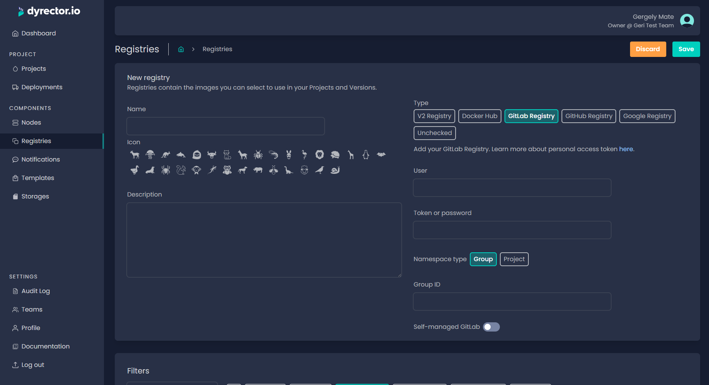

# Add GitLab Registry


You can add registries available from both self-managed or SaaS GitLab.


### Add SaaS GitLab Registry

**Step 1:** Open Registries on the left and click ‘Add’ on the top right.

**Step 2:** Enter your registry’s name and select an icon.


**Tip:** You can write a description, so others on your team can understand what’s the purpose of this registry.


**Step 3:** Select GitLab Registry type.

<figure><figcaption></figcaption></figure>

**Step 4:** Select if you'd like to add a group or a project.

**Step 5:** In the corresponding fields, enter:

* Your GitLab username,
* Your password or access token generated in GitLab with the steps documented [**here**](https://gitlab.com/-/profile/personal\_access\_tokens). Select the `read_api` and `read_registry` scopes.
* And your organization’s or your project's GitHub name. You can find either under their name in their main pages.

**Step 6:** Make sure the Self-managed GitLab toggle is off. If you select GitLab Registry type, SaaS should be set by default.

**Step 7:** Click ‘Save’ button on the top right.

### Add Self-managed GitLab Registry

**Step 1:** Open Registries on the left and click ‘Add’ on the top right.

**Step 2:** Enter your registry’s Nname and select an icon.


Tip: You can write a description, so others on your team can understand what’s the purpose of this registry.


**Step 3:** Select GitLab Registry type.

**Step 4:** In the corresponding fields, enter:

* your GitLab username,
* your password or access token generated in GitLab with the steps documented [**here**](https://gitlab.com/-/profile/personal\_access\_tokens). Select the `read_api` and `read_registry` scopes.
* And your organization’s GitHub name.

**Step 5:** Turn on self-managed GitLab toggle.

**Step 6:** Enter GitLab Registry’s URL and the GitLab API URL without the https prefixes.

**Step 7:** Click ‘Save’ button on the top right.
