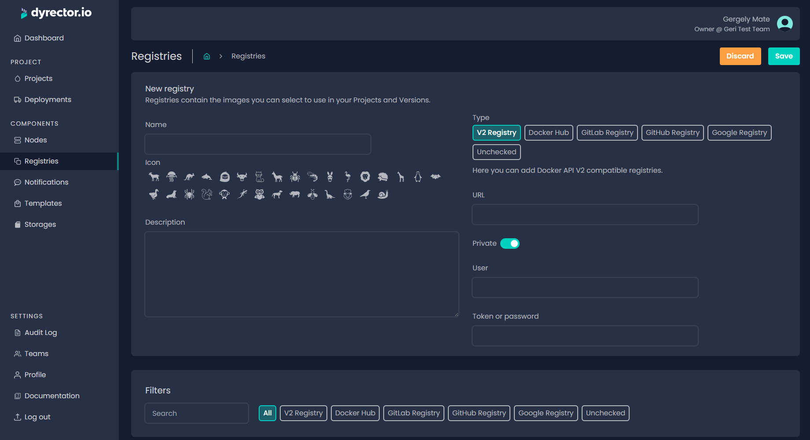

# Add V2 Registry

V2 Registries are Docker Registry HTTP API V2 compatible. Both private and public registries are supported.

### Add a private registry

**Step 1:** Open Registries on the left and click ‘Add’ on the top right.

**Step 2:** Enter your registry’s name and select an icon.


**Tip:** You can write a description, so others on your team can understand what’s the purpose of this registry.


**Step 3:** Select V2 Registry and switch the toggle under the URL field to ‘Private’.

**Step 4:** In the corresponding fields, enter:

* URL of your registry without the /v2 suffix,
* username, and
* the token or password which you use to access it.

**Step 5:** Click ‘Save’ button on the top right.

### **Add a public registry**

**Step 1:** Open Registries on the left and click ‘Add’ on the top right.

**Step 2:** Enter your registry’s name and select an Icon below.


**Tip:** You can write a description, so others on your team can understand what’s the purpose of this registry.


**Step 3:** Select V2 Registry type and switch the toggle under the URL field to ‘Public’.

**Step 4:** Enter the URL of your registry without the /v2 suffix.

**Step 5:** Click ‘Save’ button on the top right.
