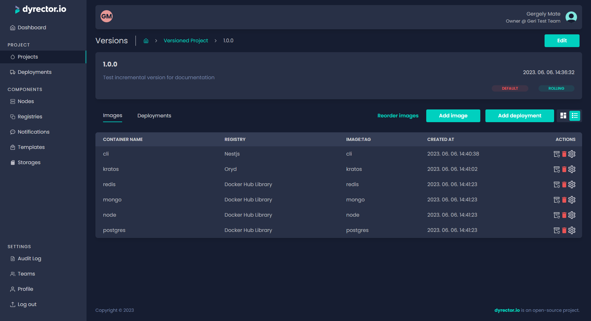

# Create a Rolling Version

Rolling versions are similar to versionless project in a way that they come with a version that can't be rolled back. They’re always mutable but contrary to incremental versions, they aren’t hierarchic and lack a version number.

**Step 1:** After picking the Rolling tag, click ‘Save’. You’ll be directed to the Project tab. Select the project again.

**Step 2:** Click ‘Add version’.

**Step 3:** Enter the rolling version's name and specify a changelog.

.png>)

**Step 4:** Click 'Save'. You'll be directed to the board of versions of your versioned project.

**Step 5:** Click 'Images' button in the card that belongs to the version you'd like to assemble.

**Step 6:** Click 'Add image'.

<figure><figcaption></figcaption></figure>

**Step 7:** Select the Registry you want to add images from.

**Step 8:** Type the image’s name to filter images. Select the image by clicking on the checkbox next to it.

<figure><figcaption></figcaption></figure>

**Step 9:** Click ‘Add’.

**Step 10:** Pick the ‘Tag’ icon next to the bin icon in the actions column to pick a version of the image you selected in the previous step.


Now you can define environment configurations to the selected image. For further adjustments, click on the JSON tab where you can define other variables. Copy and paste it to another image when necessary. Learn more about Configuration management [**here**](../../../features/configuration-management.md).


**Step 11:** Click ‘Add Image’ to add another image. Repeat until you have all the desired images included in your product.

<figure><figcaption></figcaption></figure>
