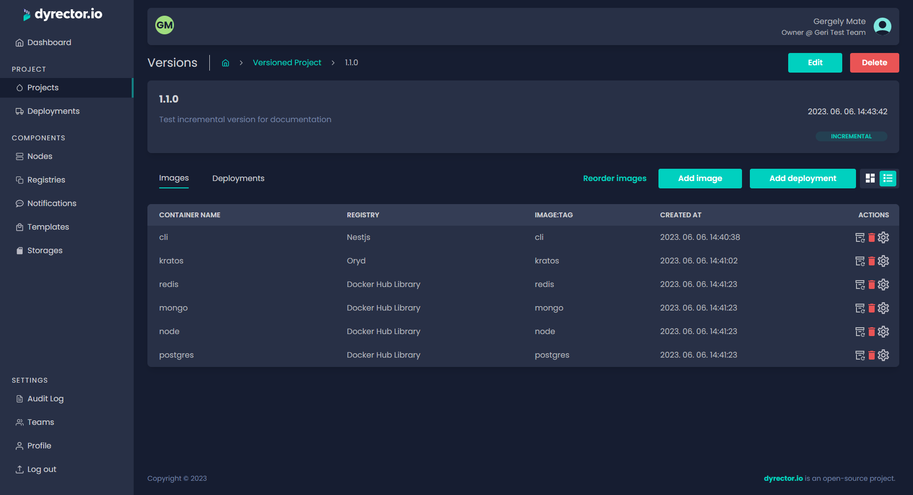

# Create an Incremental Version

Incremental versions are hierarchical in a way that they can have child versions and once a deployment is successful, the deployed versions, the environment variables, and the deployed images can never be modified. Because of this, you’re able to roll back the deployed incremental version and reinstate the last functional version.

**Step 1:** After picking the incremental tag, click ‘Save’. You’ll be directed to the incremental version’s preview. Click ‘Add Version’.

<figure><figcaption></figcaption></figure>

**Step 2:** Enter a name and a change log for the new version.

**Step 3:** Click ‘Save’. You’ll be redirected to the project's version board.

<figure><figcaption></figcaption></figure>

**Step 4:** To add images, click ‘Images’ and ‘Add Image’ on the next view.

**Step 5:** Select the Registry you want to filter images from.

**Step 6:** Type the image’s name to filter images. Select the image by clicking on the checkbox next to it.

**Step 7:** Click ‘Add’.

**Step 8:** Pick the ‘Tag’ icon next to the bin icon under the actions column to pick a version of the image you selected in the previous step.

<figure><figcaption></figcaption></figure>


Now you can define environment configurations to the selected image. For further adjustments, click on the JSON tab where you can define other variables. Copy and paste it to another image when necessary. Learn more about Configuration management [**here**](../../../features/configuration-management.md).


**Step 9:** Click ‘Add Image’ to add another image. Repeat until you have all the desired images included in your product.

### Add new version to your incremental version

**Step 1:** Open Projects and select the versioned project you’d like to increase.

**Step 2:** Click ‘Increase’ button under the version of the project you’d like to add a new version to.

**Step 3:** Enter the version's name and add changelog. Click ‘Save’.

**Step 4:** Click 'Add image’ to search for images you’d like to include in the new version. If you’d like to remove an image from the previous version, click on the red trash icon.

**Step 5:** Pick the ‘Tag’, which is a version of the image you selected in the previous step.
