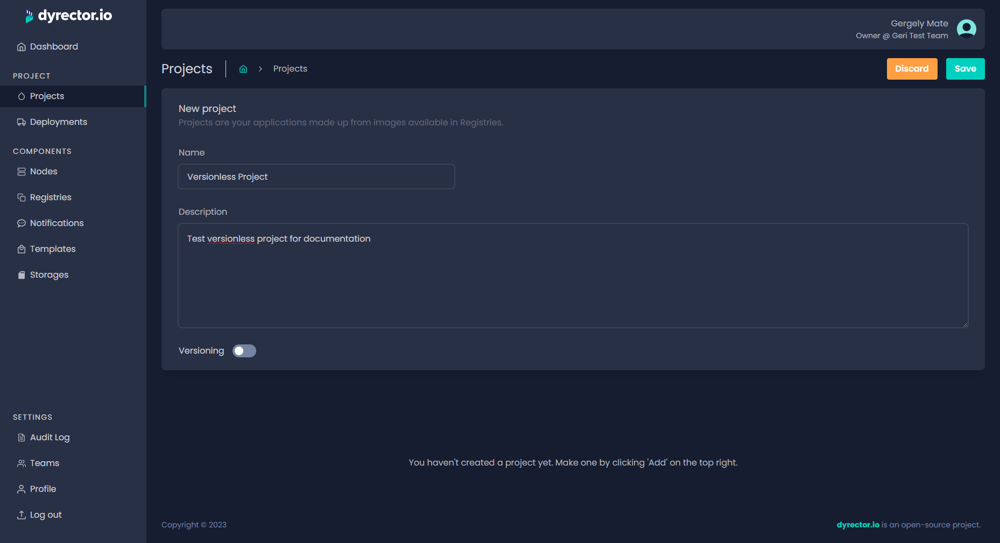
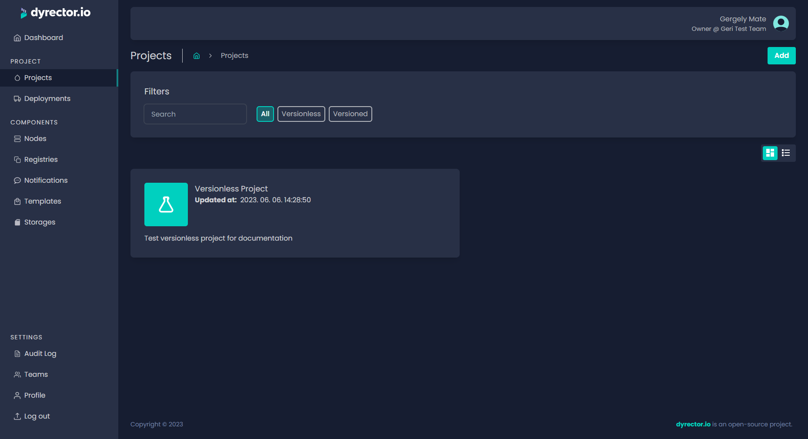
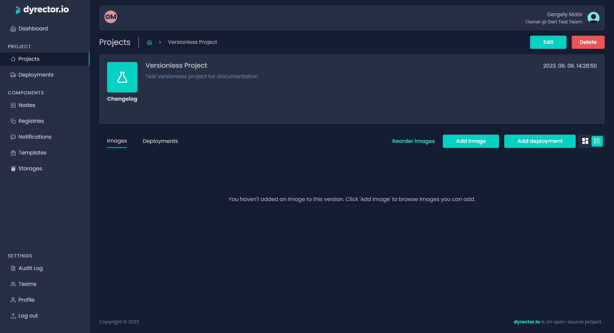
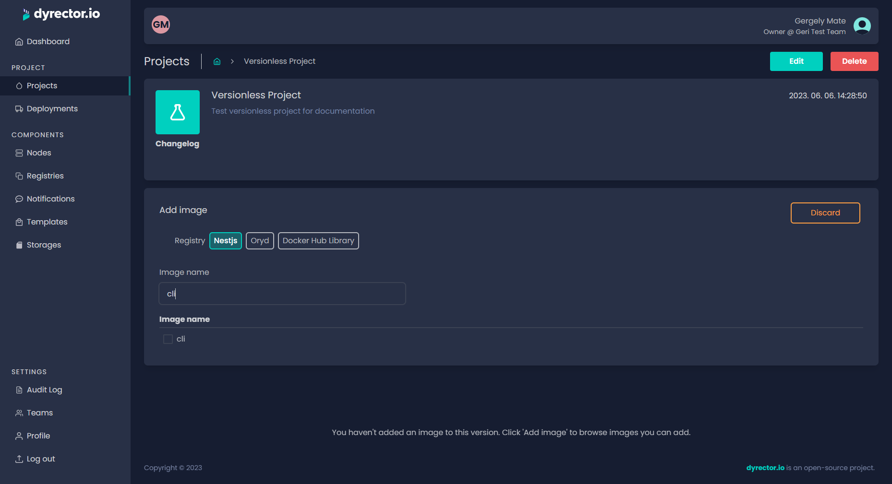
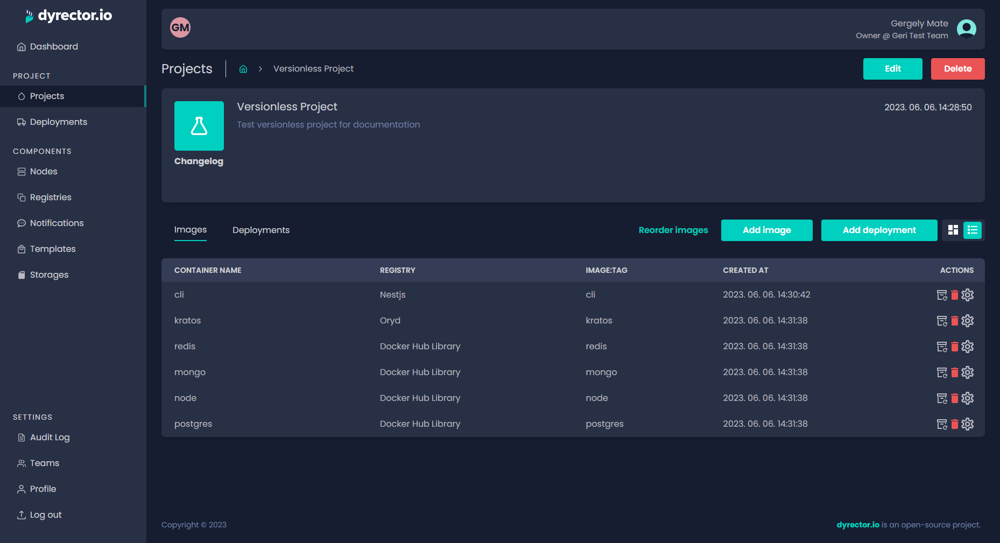

# Create a versionless project

Versionless projects have only one abstracted-away version and cannot be rolled back. These are mostly useful for testing purposes.

**Step 1:** On the Project tab, click ‘Add’ on top right.

**Step 2:** Enter the project’s name.


**Tip:** You can write a description so your teammates can understand what’s the purpose of this project.


**Step 3:** Select the versionless type under the description.

**Step 4:** Click ‘Save’. You’ll be directed to the Project tab. Select the project you just created.

**Step 5:** Click ‘Add Image’.

**Step 6:** Select the Registry you want to filter images from.

**Step 7:** Type the image’s name to filter images. Select the image by clicking on the checkbox next to it.

**Step 8:** Click ‘Add’.

**Step 9:** Click on the ‘Tag’ icon under the actions column left to the bin icon. This will allow you to select a version of the image you picked in the previous step.


You can define environment configurations to the selected image by clicking on the gear icon on the right. For further adjustments, click on the JSON tab where you can define other variables. Copy and paste it to another image when necessary. Learn more about Configuration management [**here**](../../features/configuration-management.md).


**Step 10:** Click ‘Add Image’ to add another image. Repeat until you have all the desired images included in your product.
