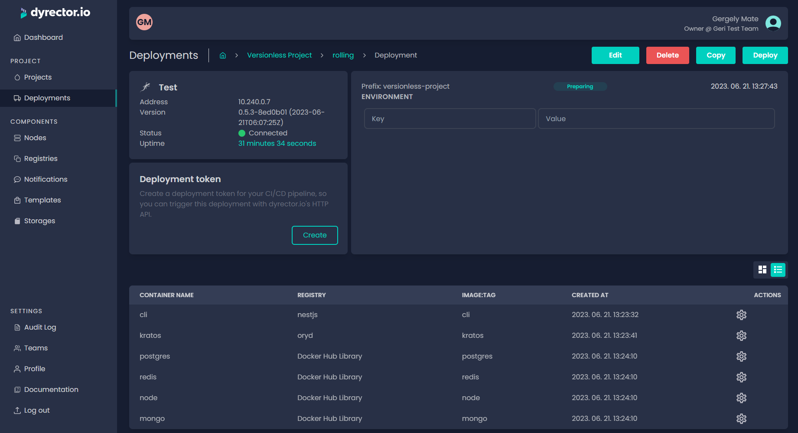

# Deploy your Project


Deployment workflows are similar for each type and version of projects but there's difference between the capabilities. You can find out more about the differences of deployment capabilities between versionless and versioned projects [**here**](../../basics/components.md#deployment).


**Step 1:** Open the project or version you would like to deploy. To demonstrate the process, we used a versionless project.

**Step 2:** Click 'Add deployment'.

**Step 3:** Select the node in the 'Add deployment' block. After that, click 'Add' on the top right corner of the block.

**Step 4:** The images of the project will be listed. By clicking on the gear icon, you are able to define and adjust configuration variables. Learn more about Configuration management [**here**](../features/configuration-management.md).

**Step 5:** Click 'Deploy'. If everything goes right, deployment status should switch from 'Preparing' to 'In progress'. When deployment's complete the status should turn 'Successful'.

You can see status change for each image on the 2nd picture below.

### Deployment deletion

Deleting a deployment will only remove the containers from the platform. Infrastructure related data, including volumes and networks, will remain stored on the node.

### Troubleshooting

When you can't deploy a version or a project because node status turns outdated, you should navigate to your node's edit page and update the agent by clicking the _Update_ button.
