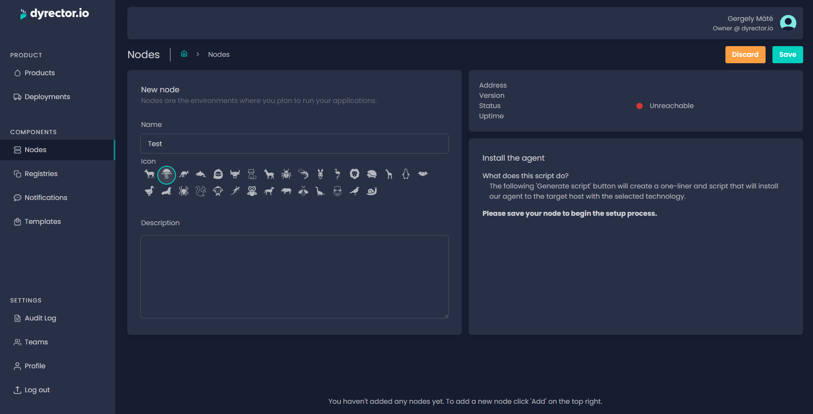
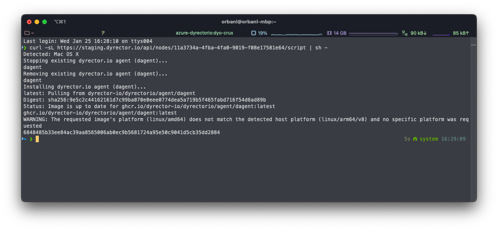
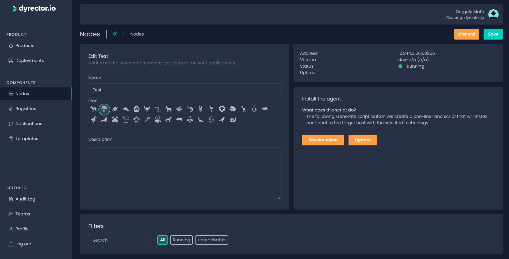

# Add your Node

**Nodes are the environments that'll be the target of your deployments.**


Node setups require admin or root privilege. Without that, it's not possible to [**install**](register-your-node.md) dyrector.io's agent on your node in the case of both Docker and Kubernetes.

If you're curious about the install scripts of the agent, you can check them out at the links below:

* [**Docker**](https://github.com/dyrector-io/dyrectorio/blob/develop/web/crux/assets/install-script/install-docker.sh.hbr)
* [**Kubernetes**](https://github.com/dyrector-io/dyrectorio/blob/develop/web/crux/assets/install-script/install-k8s.sh.hbr)


**Step 1:** Open Nodes on the left and click ‘Add’ on top right.

**Step 2:** Enter your node’s name and select its icon.


Tip: You can write a description so others on your team can understand what’s the purpose of this node.


**Step 3:** Click ‘Save’ and select the type of technology your node uses. You can select

* Docker Host,
* and Kubernetes Cluster.

Docker Host requirements are the following:

* a Linux host/VPS,
* Docker or Podman installed on host,
* ability to execute the script on host.

Kubernetes Cluster requirements are the following:

* a Kubernetes cluster,
* kubectl authenticated, active context selected,
* ability to run these commands.

Users are able to opt-in to install Traefik, as well. In that case they need to add an ACME email address where they'll be updated when their certification expires.


Traefik's Docker instance is only supported on Linux. Further details about it at the official Docker [**documentation**](https://docs.docker.com/network/host/).


**Step 4:** Depending on your node's OS, select whether you'd like to generate a shell or a powershell script. Shell scripts are supported on Linux Nodes, powershell scripts are designed to be used with Windows nodes.

**Step 5:** After picking the technology and the script's type, click the ‘Generate script’ button to generate a one-liner script.

.png>)

**Step 6:** Run the one-liner in sh or bash.

<figure><figcaption></figcaption></figure>

The one-liner will generate a script that’ll set the platform’s agent up on your Node.

**Information and status of your Node will show in the Connection section, so you can see if the setup is successful right away.**

<figure><figcaption></figcaption></figure>

**Now you're ready to setup your product and one step closer deploy your application.**
