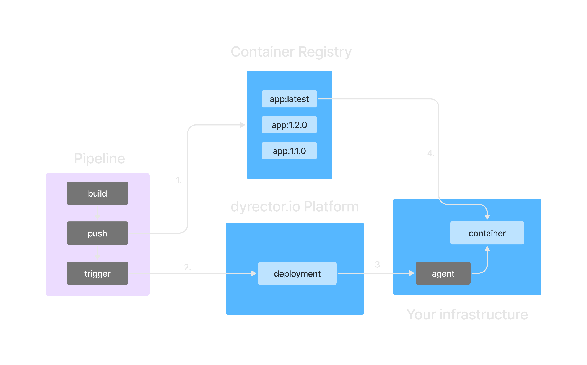
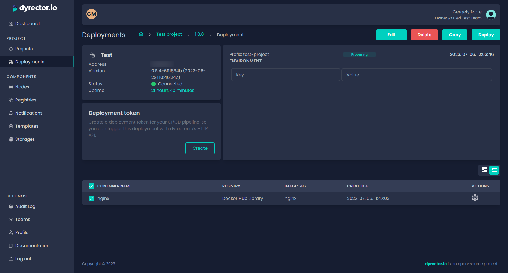
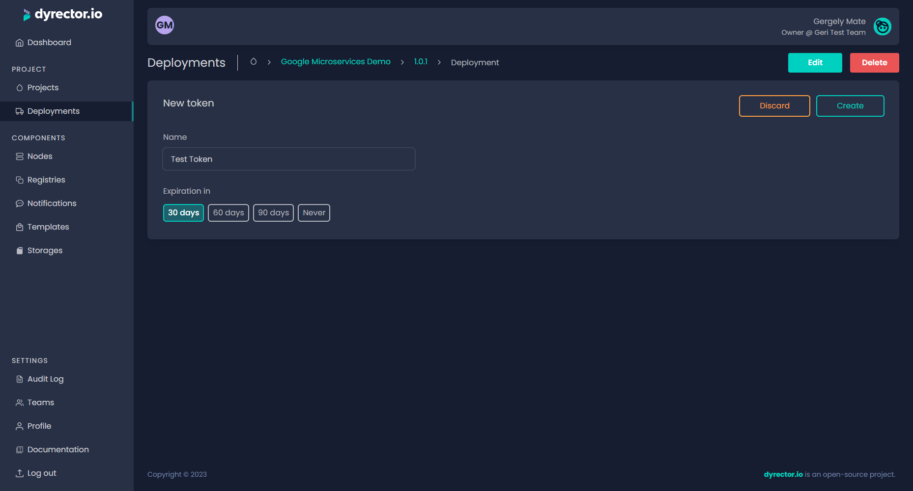
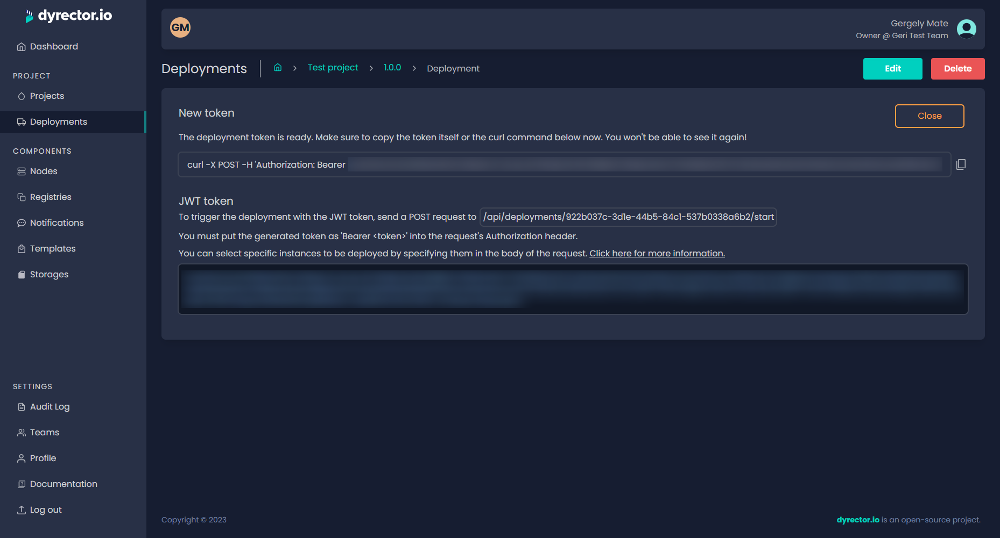
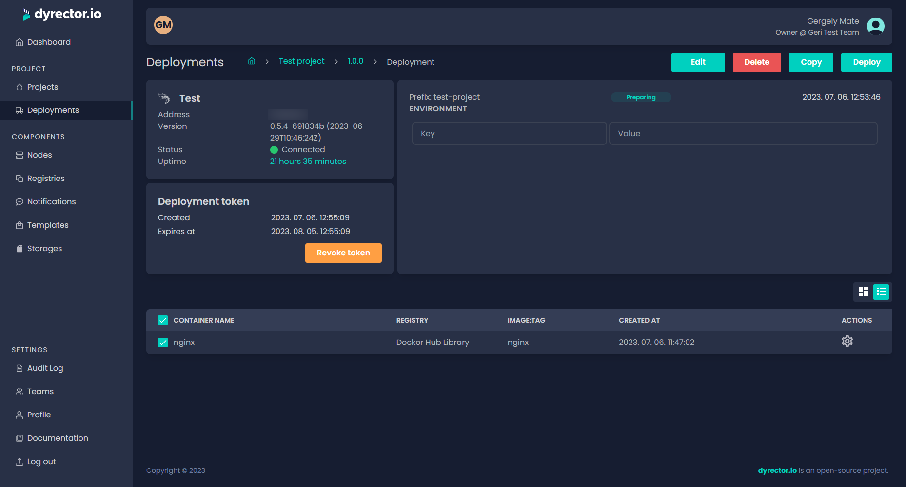

# Continuous Deployment

### How it works?

After the CI/CD pipeline builds and pushes the image to a container registry, the pipeline triggers the deployment on the platform. The platform automatically signals to the agent that it should pull and start the image with the tag that already exists on the node.

<figure><figcaption></figcaption></figure>

### Generate CD token

**Step 1.** [**Create**](../docs/tutorials/create-your-product/) a versioned project.

**Step 2.** Add a rolling version to the project.

**Step 3.** Add images to the version.

**Step 4.** [**Add**](../docs/tutorials/deploy-your-product.md) a deployment to the version.

**Step 5.** Click _Create_ in the Deployment token card.

<figure><figcaption></figcaption></figure>

**Step 6.** Enter a name for your deployment token and set its expiration time, then click _Create_. You'll need to generate a new one when the token expires.

<figure><figcaption></figcaption></figure>

**Step 7.** Save the token somewhere secure as you won't be able to retrieve it later. Click _Close_ when you're done.

<figure><figcaption></figcaption></figure>

**Step 8.** Paste the curl command into the pipeline.


**Never store your token in your git repository. Use pipeline secrets instead.**


#### How to revoke token?

You can revoke the token by clicking on the _Revoke token_ button in the _Deployment token_ card.

<figure><figcaption></figcaption></figure>
