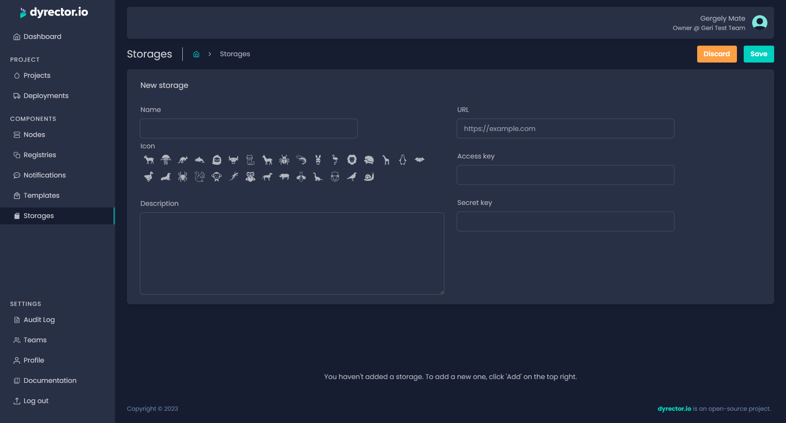

# Storage

File injection to containers is possible with the Storage function. It's S3 API compatible, as of now only Azure Blob Storage isn't supported.


Storage capabilities don't cover configuration backup storage. It's sole purpose is to offer a way for [**file injection**](../tutorials/inject-files-to-a-container.md).


<figure><figcaption></figcaption></figure>

We decided to go with S3 API compatible storages as it’s one of the most popular technologies that offer interoperability with a fair number of open-source projects. They represent a bunch of functions as flat structure file storages, including versioning, different types of access control, and so on.

One example of S3 API use cases is to upload the object via a REST endpoint and the object will be available through a simple URL.

Amazon's S3 solution isn’t open-source but a few S3 API compatible open-source implementations are listed below:

* MinIO,
* OpenIO,
* Scality.


You can set up the S3 implementations mentioned above as Docker containers. Find out how in the [**Tutorials**](broken-reference) section.

