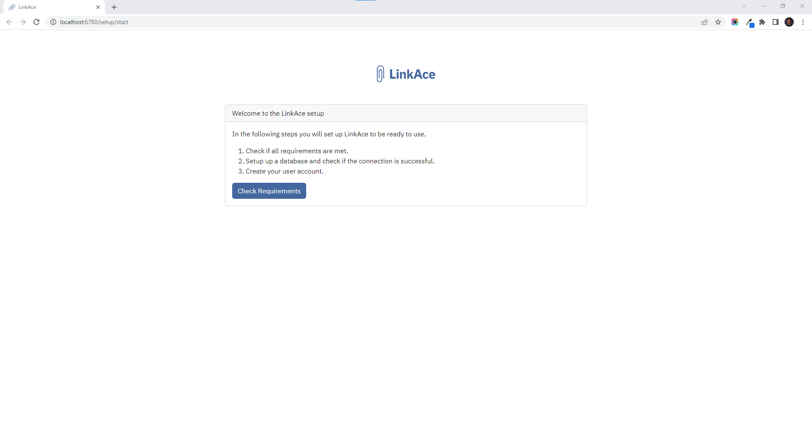

# LinkAce

[**LinkAce**](https://github.com/Kovah/LinkAce/) **is a self-hosted archive to collect links of your favorite websites. You can quickly set it up on your infrastructure. Template consists of MariaDB (10.7) and LinkAce image with `simple` tag.**&#x20;

After the Node where you'd like to run LinkAce is [**registered**](../../docs/tutorials/register-your-node.md), you can set it up by following the steps of deployments as documented [**here**](../../docs/tutorials/deploy-your-product.md).

Requirements:

1. `APP_KEY` environment variable must be 32 characters long.
2. After deployment, exec in the linkace-app container and add `chmod 777` privileges to the `\app\.env` file.

Once the deployment is successful, LinkAce is ready to use at [**localhost:6780**](http://localhost:6780/) by default, as seen below.

<figure><figcaption></figcaption></figure>
