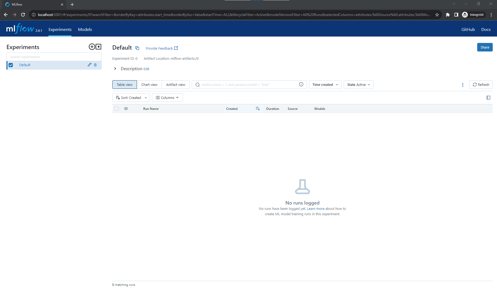

# MLflow

[**MLflow**](https://mlflow.org/) **is a platform to streamline machine learning development, including tracking experiments, packaging code into reproducible runs, and sharing and deploying models. The** [**Docker image**](https://hub.docker.com/r/adacotechjp/mlflow/tags) **of MLflow is available with the `2.4.0` tag.**

After the node where you'd like to run MLflow is [**registered**](../../docs/tutorials/register-your-node.md), you can set it up by following the steps of deployments as documented [**here**](../../docs/tutorials/deploy-your-product.md).

Once the deployment is successful, MLflow is ready to use at [**http://localhost:5001/**](http://localhost:5001/) by default, as seen below.

<figure><figcaption></figcaption></figure>
