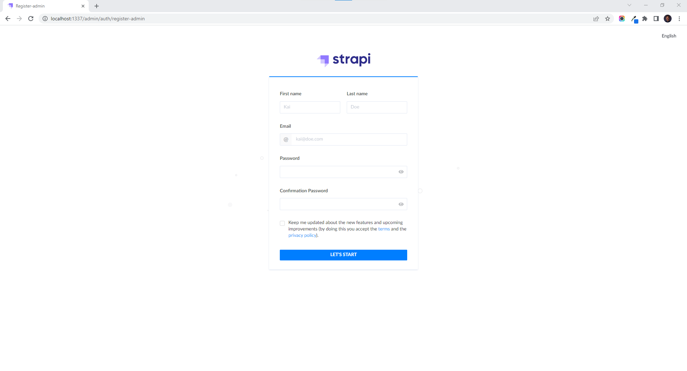

# Strapi

[**Strapi**](https://strapi.io) **is a CMF that allows developers to build APIs in Node.js. It's mainly used to build content-driven applications or websites. You can quickly set it up on your infrastructure. Both images of Strapi are available with `latest` tag.**

After the Node where you'd like to run Strapi is [**registered**](../../docs/tutorials/register-your-node.md), you can setup Strapi by following the steps of deployments as documented [**here**](../../docs/tutorials/deploy-your-product.md).

Once the deployment is successful, Strapi is ready to use at [**localhost:1337**](http://localhost:1337/admin/) by default, as seen below.

<figure><figcaption></figcaption></figure>
