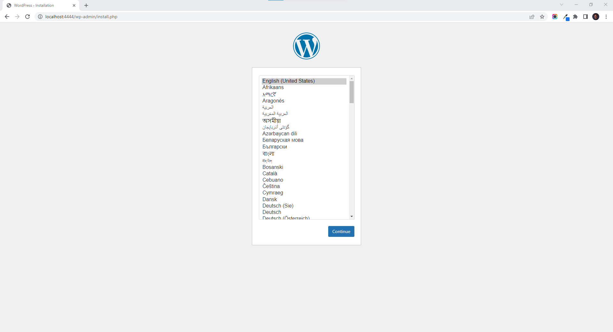

# WordPress

[**WordPress**](https://wordpress.com/) **is the most popular CMS. More than 43% of all websites are managed with it. You can quickly set it up wherever you'd like to manage your content with WordPress. Image is available with `latest` tag.**

After the Node where you'd like to run WordPress is [**registered**](../../docs/tutorials/register-your-node.md), you can setup WordPress by following the steps of deployments as documented [**here**](../../docs/tutorials/deploy-your-product.md).

Once the deployment is successful, WordPress is ready to use at [**localhost:4444**](http://localhost:4444) by default, as seen below.

<figure><figcaption></figcaption></figure>
