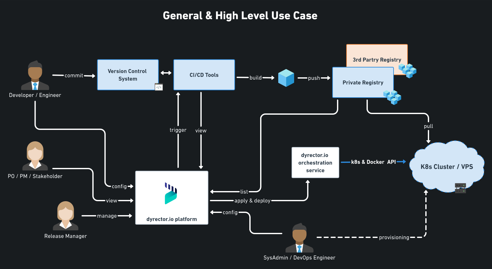

# Overview


If you want to learn how you can deploy applications with dyrector.io, check the [**Tutorials**](broken-reference) section. However, it's important to go through the Get Started section for successful adoption of dyrector.io.


There are four roles involved in dyrector.io’s workflow. These are Developers, Release Managers, SysAdmins / DevOps Engineers and Stakeholders. Based on their responsibilities, they interact differently with dyrector.io.

### General use case of dyrector.io

In the flowchart below you can see how dyrector.io fits into Software Development Lifecycle (SDLC).

* Your Developer teammate commits to a Registry, which your Release Manager teammate gets notified about.
* The Release Manager or any stakeholder can set up a testing environment self-service to validate the new version’s functionality by deploying the applications to their own machine.
* After successful testing, the Release Manager or any stakeholder can trigger the deployment of the new version.

In case of an emergency, specialist or non-specialist stakeholders can intervene on an abstract level via dyrector.io to avoid downtime for a temporary fix.

### Developers / Engineers

Developers commit to either a 3rd party or a private Registry. The image is then built automatically – this process can be triggered via dyrector.io, as well, if necessary. Once the image is built, it’s available to push to the Registry.

### Release Managers

In this case, Release Manager is a superficial role. They can be project managers, billing coordinators, basically anyone who interacts with dyrector.io and is responsible of making sure the corresponding version is deployed to the users. Release Managers have access to the Products, and they can deploy them to the Nodes with a single click. They’re able to validate the Product’s functionality and monitor the development progress. Besides these, they can create release notes so everyone can understand how a certain version or product is different.

### SysAdmins / DevOps Engineers

DevOps engineers configure the components that make up the workflow, including the Nodes, pipelines and services.

### Product Owners, Project Managers, Stakeholders

Stakeholders have access to Product information, but they can’t execute any actions regarding them.

