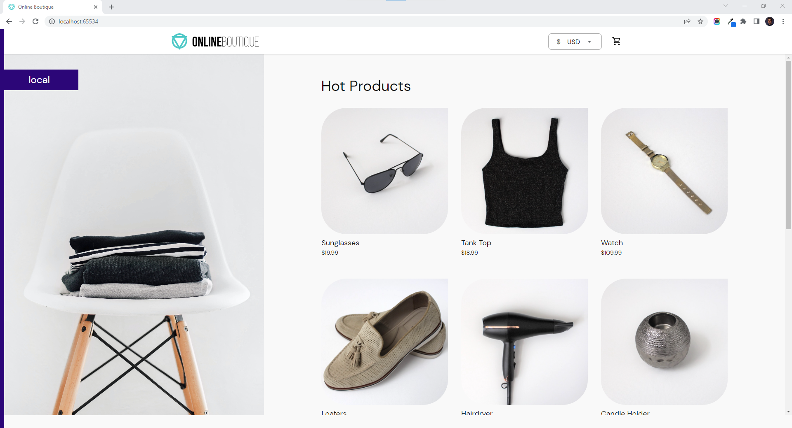

# Google Microservices Demo

[**Google Microservices Demo**](https://github.com/GoogleCloudPlatform/microservices-demo) **is used to how to build and deploy microservices-based applications using Google Cloud Provider (GCP). Google Microservices Demo allows users to demonstrate use of technologies like Kubernetes/GKE, Istio, Stackdriver, gRPC and OpenCensus. dyrector.io users can quickly set Google Microservices Demo up on their infrastructure.**


All images are available with `0.4.1` tag in the template.


After the Node where you'd like to run Google Microservices Demo is [**registered**](../../docs/tutorials/register-your-node.md), you can set it up by following the steps of deployments as documented [**here**](../../docs/tutorials/deploy-your-product.md).

Once the deployment is successful, Google Microservices Demo is ready to use at  [**localhost:65534**](http://localhost:65534) by default, as seen below.

<figure><figcaption></figcaption></figure>
