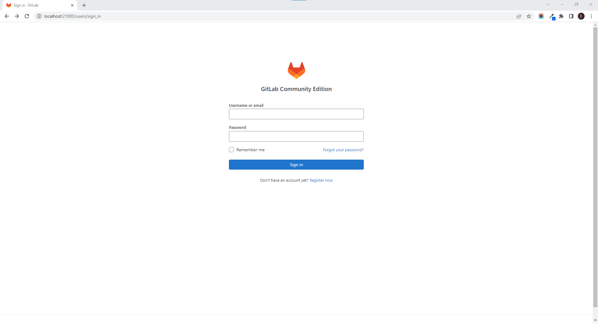

# Self-managed GitLab

[**Self-managed GitLab**](https://about.gitlab.com/install/) **is an open-source version of GitLab to manage your code. It's key advantage is that users can configure GitLab to their needs. dyrector.io users can quickly set it up on their infrastructure. Image comes with `latest` tag in the template.**

After the Node where you'd like to run GitLab is [**registered**](../../docs/tutorials/register-your-node.md), you can set it up by following the steps of deployments as documented [**here**](../../docs/tutorials/deploy-your-product.md).

Once the deployment is successful, self-managed GitLab is ready to use at [**localhost:21080**](http://localhost:21080/) by default.

<figure><figcaption></figcaption></figure>
