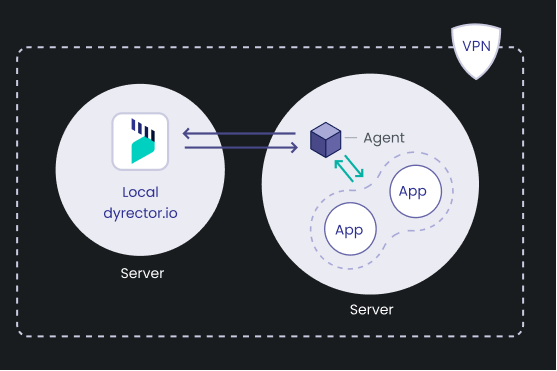

# How it works

dyrector.io consists of an agent – crane for Kubernetes API and dagent for Docker API, both written in Go – and a platform (UI developed in React.js, Next.js. Backend developed in Node.js, Nest.js). Communication between the agents and the platform takes place in gRPC with TLS encryption. The data is managed in a PostgreSQL database which we use with Prisma ORM.

### Cloud-hosted dyrector.io (alpha access)


dyrector.io alpha is suggested for non-production purposes. If you want to use dyrector.io for production, reach out to us at [**hello@dyrector.io**](mailto:hello@dyrector.io).


### Self-managed dyrector.io

Self-hosted dyrector.io is free and will always be, without feature and usage restrictions.

