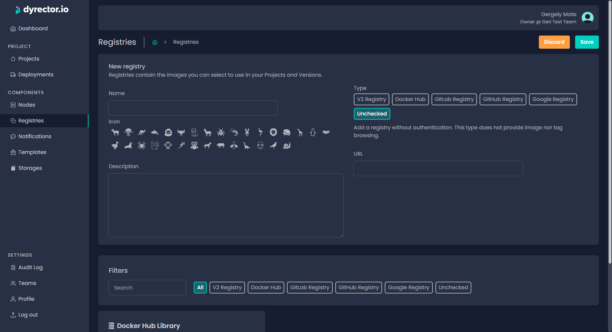

# Add Unchecked Registry

Unchecked means image availibility checking is disabled. Any HTTP API V2 compatible registry can be added this way, but images and their tags cannot be browsed when assembling a project. You can add an image to a project from an unchecked registry by entering the image's exact name and when needed, the tag.


When you add images from an unchecked registry to a project, and the image's name doesn't match, the deployment will fail.


### How to add an unchecked registry?

**Step 1:** Open Registries on the left and click ‘Add’ on the top right.

**Step 2:** Enter your registry’s name and select an icon.


**Tip:** You can write a description, so others on your team can understand what’s the purpose of this registry.


**Step 3:** Select Unchecked Registry and switch the toggle under the URL field to ‘Private’.

<figure><figcaption></figcaption></figure>

**Step 4:** In the corresponding fields, enter the registry's URL.

**Step 5:** Click ‘Save’ button on the top right.
