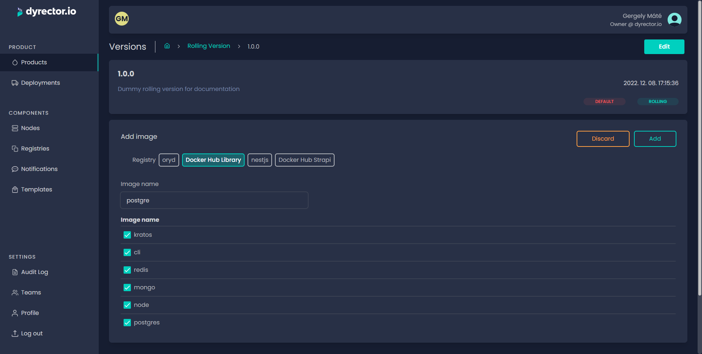
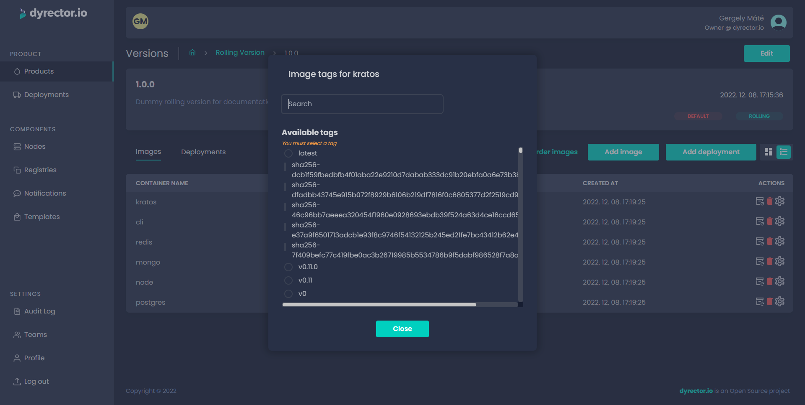

# Create a Rolling Version

Rolling Versions are similar to Simple Products except they’re perfect for continuous delivery. They’re always mutable but contrary to Incremental Versions they aren’t hierarchic and lack a version number.

**Step 1:** After picking the Rolling tag, click ‘Save’. You’ll be directed to the Product tab. Select the product again.

**Step 2:** Click ‘Add version’.

**Step 3:** Enter the rolling version's name and specify a changelog.

**Step 4:** Click 'Save'. You'll be directed to the board of versions of your Complex Product.

**Step 5:** Click 'Images' button that belongs to the version you'd like to assemble.

.png>)

**Step 6:** Click 'Add image'.

**Step 7:** Select the Registry you want to filter images from.

**Step 8:** Type the image’s name to filter images. Select the image by clicking on the checkbox next to it.

**Step 9:** Click ‘Add’.

<figure><figcaption></figcaption></figure>

**Step 10:** Pick the ‘Tag’ icon next to the bin icon in the actions column to pick a version of the image you selected in the previous step.


Now you can define environment configurations to the selected image. For further adjustments, click on the JSON tab where you can define other variables. Copy and paste it to another image when necessary. Learn more about Configuration management [**here**](../../../features/configuration-management.md).


**Step 11:** Click ‘Add Image’ to add another image. Repeat until you have all the desired images included in your product.
