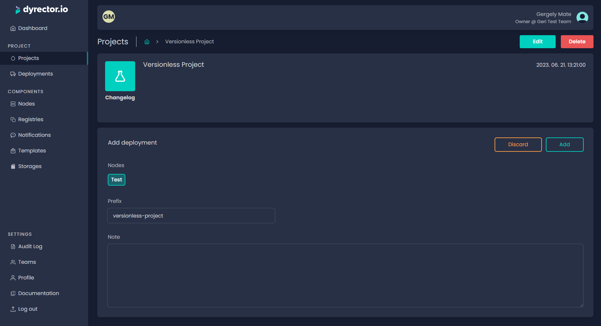
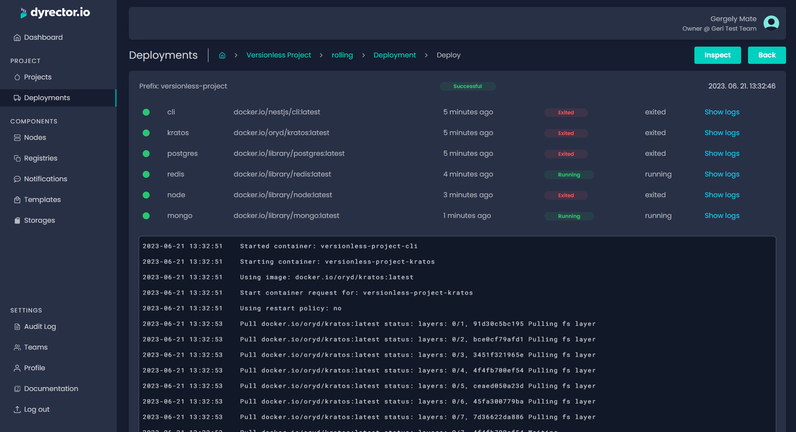

# Deploy your Product

Deploying the Product is the final stage of dyrector.io's core functionality. You can do it by following the steps below.


Deployment workflows are similar for each type and version of Products but there's difference between the capabilities. You can find out more about the differences of deployment capabilities between Simple and Complex Products [**here**](../get-started/components.md#deployment).


**Step 1:** Open the Product or Version you would like to deploy. For demonstration, we used a Simple Product.

**Step 2:** Click Add deployment.

**Step 3:** Select the Node in the Add deployment block. After that, click Add on the top right corner of the block.

**Step 4:** The images of the Product will be listed. By clicking on the gear icon, you are able to define and adjust configurations. Learn more about Configuration management [**here**](../features/configuration-management.md).

**Step 5:** Click 'Deploy'. If everything goes right, deployment status should switch from 'Preparing' to 'In progress'. When deployment's complete the status should turn 'Successful'.

You can see statuses changed for each image on the 2nd picture below.

### Deployment deletion

Deleting a deployment will only remove the containers. Infrastructure related data, including volumes and networks, will remain on the node.
